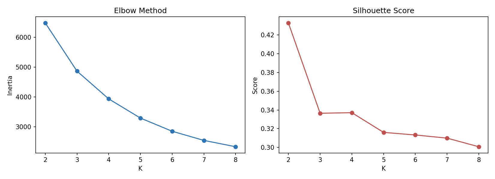
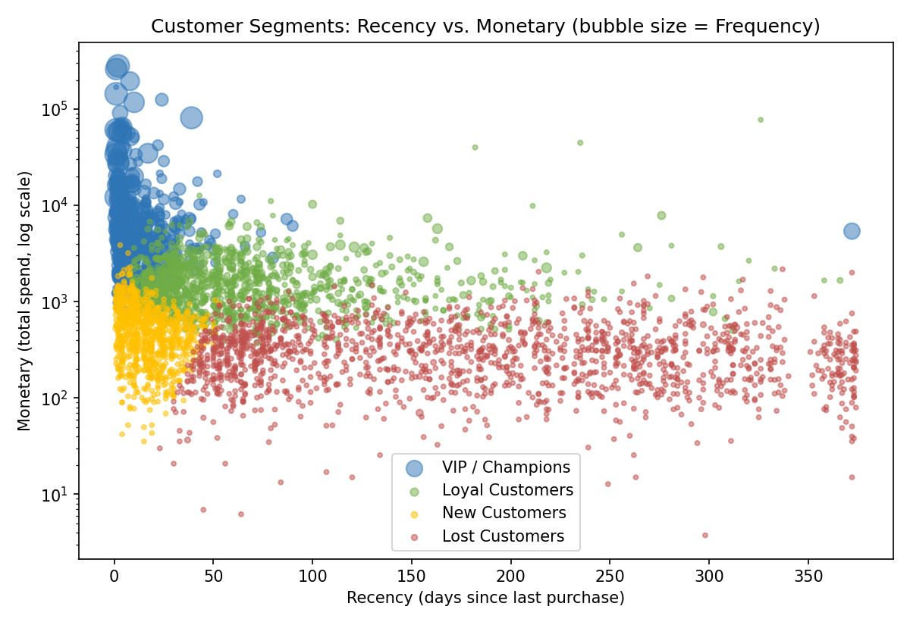
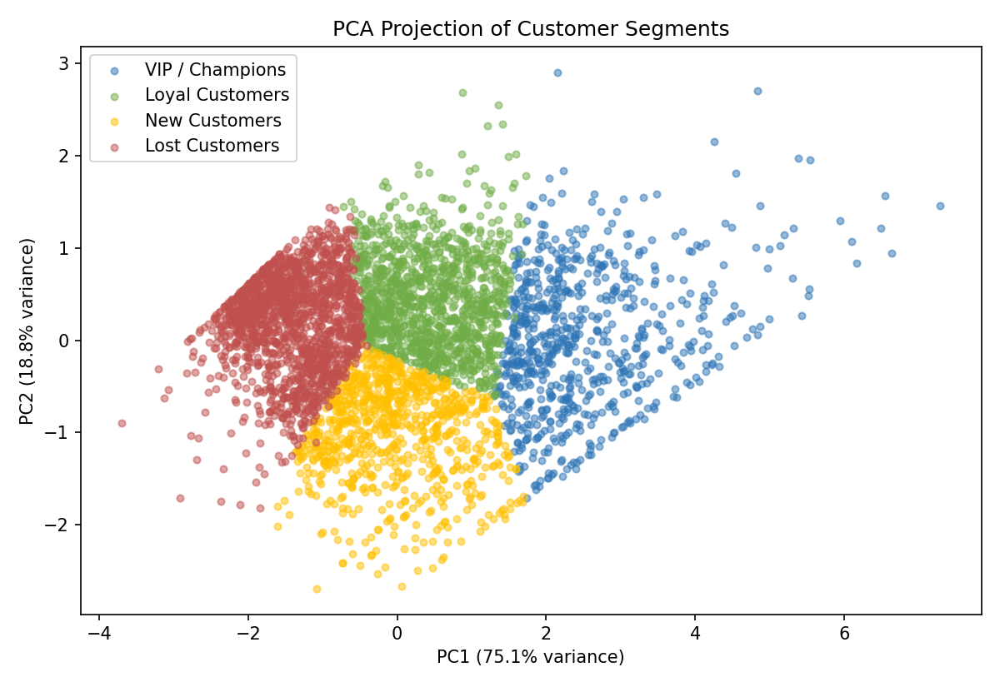
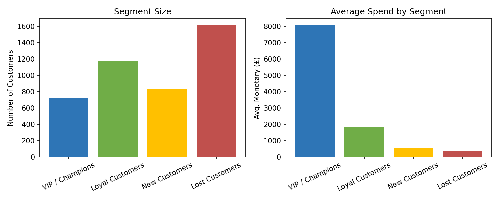
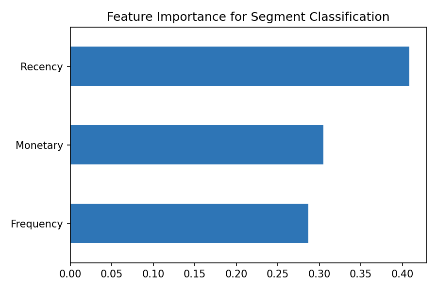
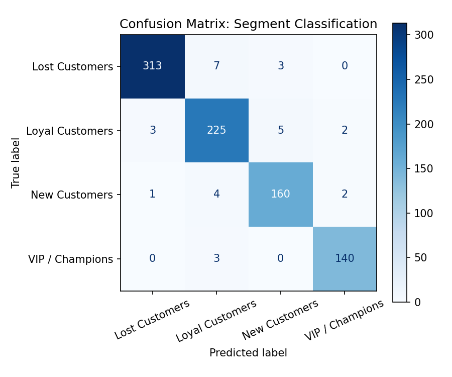

# Data-Driven Customer Segmentation for Marketing Optimization

RFM Analysis + K-Means Clustering | End-to-End Business Analytics Case Study

**Author:** Tsend-Ayush Ganbold
**Tech stack:** Python · pandas · scikit-learn · SciPy · statsmodels · matplotlib

---

## Overview

Marketing teams often allocate promotional budget uniformly across all customers, which
wastes spend on customers who were never going to churn and under-invests in the ones who
actually drive revenue. This project builds a segmentation model on 541,909 real e-commerce
transactions (4,338 customers) to answer four questions a marketing team would realistically
ask: who deserves loyalty rewards, who's at risk of leaving, who drives the most revenue, and
who's new and needs onboarding.

The workflow covers data cleaning, exploratory analysis, RFM feature engineering, K-Means
clustering, and statistical validation — with every methodological choice (why K=4, why
log-transform, why Recency matters as much as spend) justified rather than assumed.

## Dataset

UCI Machine Learning Repository — **Online Retail**. 541,909 transactions from a UK-based
online retailer, Dec 2010–Dec 2011. Columns: InvoiceNo, StockCode, Description, Quantity,
InvoiceDate, UnitPrice, CustomerID, Country.

## Data Cleaning

- Removed cancelled orders (InvoiceNo starting with "C")
- Removed rows with missing CustomerID — can't segment a customer you can't identify
- Removed negative/zero Quantity and UnitPrice (data errors, not real purchases)
- Created `Revenue = Quantity × UnitPrice`

541,909 → 397,884 clean rows across 4,338 unique customers.

## Exploratory Analysis

Before segmenting, I looked at where revenue actually comes from: revenue concentration by
country, monthly revenue trend, top products, and how orders are distributed across
customers. This is mostly a sanity check — it surfaces obvious data issues early and gives
context for interpreting the segments later.

## Feature Engineering: RFM

- **Recency** — days since last purchase (lower = more engaged)
- **Frequency** — number of distinct orders (higher = more loyal)
- **Monetary** — total amount spent (higher = more valuable)

## Scaling

RFM distributions are heavily right-skewed — a small number of high-volume buyers place
many high-value orders, which is typical of retail data. K-Means uses Euclidean distance,
so unscaled, skewed features would let Monetary dominate the clustering. Features were
log-transformed (`log1p`) and standardized (`StandardScaler`) before fitting.

## Choosing K

Tested K=2 through K=8 using the Elbow Method and Silhouette Score. Silhouette is
statistically maximized at K=2 (0.433), but that collapses into an uninformative "big
spenders vs. everyone else" split — not something a marketing team can act on.

**K=4 was chosen instead** (silhouette=0.337): the first local optimum after K=2, and the
smallest K that still produces segments a marketing team could design distinct campaigns
around. This is a deliberate trade-off — statistical optimality isn't always the right
optimization target when the output needs to be business-usable.

## Clustering & Segment Profiles

K-Means (K=4, `random_state=42`, `n_init=10`) fit on the scaled RFM features. Segments were
labeled using Recency **and** Monetary together, not spend rank alone — a cluster with low
spend but very recent purchases is a "new" customer worth nurturing, which is a completely
different situation from a cluster with low spend and no purchases in six months.

| Segment | % of Customers | Avg. Recency | Avg. Frequency | Avg. Monetary |
|---|---|---|---|---|
| VIP / Champions | 16.5% | 12.1 days | 13.7 orders | £8,074 |
| Loyal Customers | 27.0% | 71.1 days | 4.1 orders | £1,803 |
| New Customers | 19.3% | 18.1 days | 2.1 orders | £552 |
| Lost Customers | 37.2% | 182.5 days | 1.3 orders | £344 |

## Statistical Validation

Visual separation in a scatter plot isn't proof that segments actually differ — I validated
it properly. A one-way ANOVA on Monetary value across the four segments gives **F=148.32,
p<0.001**, so the separation isn't due to chance.

I then ran a Tukey HSD post-hoc test to check which specific segment pairs differ, and found
something worth flagging: **New Customers and Lost Customers are not significantly different
in Monetary value alone (p=0.94)**. On spend alone, they'd look like the same group. That's
exactly why segments were labeled using Recency jointly with Monetary — ranking by spend
alone would have quietly merged a promising new customer with someone who hasn't bought
anything in six months, and the recommended actions for those two groups are opposites.

## Business Recommendations

| Segment | Action |
|---|---|
| **VIP / Champions** | Loyalty rewards, early access, dedicated support — they drive disproportionate revenue relative to their size |
| **Loyal Customers** | Cross-sell / upsell campaigns; nurture toward VIP |
| **New Customers** | Onboarding sequence, welcome discount — build the habit before they go dormant |
| **Lost Customers** | Low-cost win-back only — largest segment by count (37.2%) but weakest by value; don't over-invest here |

VIP customers are 16.5% of the base but generate revenue wildly disproportionate to that
share, while Lost Customers are the largest segment by count (37.2%) and the least valuable
— a fairly clean Pareto pattern. Budget should follow that asymmetry, not headcount.

## Beyond E-Commerce

The same RFM logic applies directly to subscription businesses. A telecom operator could
segment subscribers the same way — Recency as days since last recharge, Frequency as
recharges per month, Monetary as ARPU — to flag churn-risk users and high-value subscribers
worth protecting, using the exact same pipeline.

## Predictive Extension: Fast Segment Classification

K-Means assigns segments by computing distance to cluster centroids — useful for a batch
analysis, but not something you'd want to recompute for every new transaction. I trained a
Random Forest classifier to approximate the same assignment rule as a lightweight,
interpretable lookup (97% accuracy, weighted F1=0.97 on a held-out test set of 868 customers).

**Important caveat:** since segments were derived directly from RFM values via K-Means, this
model is best understood as a fast approximation of the clustering rule, not a solution to
the cold-start problem of predicting a customer's segment before they have any purchase
history. A genuine early-lifecycle prediction model would need different features — first-order
value, signup channel, or browsing behavior.

Feature importance confirms the earlier statistical finding: **Recency (0.41)** is the
strongest predictor, ahead of Monetary (0.31) and Frequency (0.29). This lines up with the
Tukey HSD result above — since New and Lost customers are statistically indistinguishable on
Monetary alone (p=0.94), the model has to lean on Recency to separate them, which is exactly
the pattern the statistical test predicted.

Misclassifications cluster at two boundaries: Lost↔Loyal (7 errors) and Loyal↔New (5 errors)
— customers sitting near a cluster edge rather than at its center. This tracks with the
moderate Silhouette score (0.337) reported earlier: K-Means didn't produce perfectly separated
clusters, and the classifier's errors show up exactly where that imperfect separation predicts
they would, rather than being spread randomly across all segment pairs.

## Early-Lifecycle Prediction: Will a New Customer Become VIP?

Using only a customer's first 90 days of purchase behavior — order frequency, total
spend, and average order value — I trained a logistic regression model to predict
whether they would ultimately become a VIP customer over their full lifetime, using a
cohort of 2,815 customers with at least 6 months of subsequent history (to avoid biasing
results with customers who simply hadn't had time to be observed).

**ROC-AUC: 0.884** — early behavior is a strong predictor of eventual VIP status, well
above chance (0.5).

The model favors recall over precision for the VIP class (recall=0.71, precision=0.64),
using class-weighted training deliberately: in a real deployment, the cost of missing a
future VIP (a lost retention opportunity) is higher than the cost of a false positive
(a slightly wasted onboarding discount). This threshold could be tuned differently
depending on the actual cost structure of the marketing action being triggered.

**Business application:** flag high-probability future-VIP customers within their first
90 days for early loyalty enrollment or dedicated onboarding — rather than waiting 6+
months for the RFM-based segmentation to naturally identify them.

## Limitations

- RFM is product-agnostic; segmenting within product categories could add resolution
- The early-lifecycle model only uses first-90-day transaction behavior; adding signup
  channel, marketing source, or browsing data (if available) could improve prediction
  further, especially for the customers the model currently misses (recall=0.71)
- K-Means assumes spherical, similarly-sized clusters — worth comparing against DBSCAN or
  Gaussian Mixture Models, especially given the boundary misclassifications observed above
- The 90-day cutoff and 6-month cohort window were chosen for this dataset's ~12-month span;
  a production deployment would need to validate these windows against actual business cycles

## Files

- `customer_segmentation.ipynb` — full notebook, code and outputs included
- `customer_segments.csv` — every customer with RFM values, cluster ID, and segment label
- `cluster_profile.csv` — summary statistics per segment
- `images/` — exported charts: elbow/silhouette, segment scatter, PCA projection, segment
  summary, feature importance, confusion matrix
